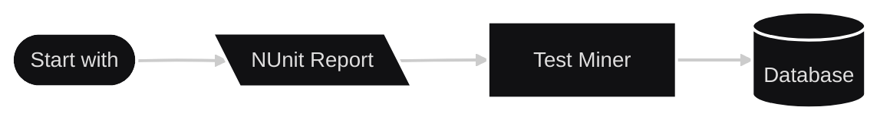

<p align="center"></p>
  
[](https://dashboard.stryker-mutator.io/reports/github.com/lyndychivs/TestMiner/master)

## 🔭 High Level
Test Miner was designed to parse NUnit3 Test Reports and store the results into a Relational Database.

The Database would provide users with the means to historically track and monitor trends of Test Results.

**Simple Flow:**


## Prerequisites
| Prerequisite        | Note |
| :---                | :--- |
| .NET8 SDK           | .NET8 or greater required.<br/>Check current .NET version `dotnet --version`.<br/>Download .NET8 [here](https://dotnet.microsoft.com/en-us/download/dotnet/8.0). |
| SQL Server          | The Database template can be found within this repository [here](TestMiner.Database). <br/>Download SQL Server Express [here](https://www.microsoft.com/en-us/sql-server/sql-server-downloads).<br/>You're on the hook to pay for the storage. 😂 |
| NUnit3 Test Results | The NUnit3 Test Results must be in XML format.<br/>Use `--result=TestResult.xml;format=nunit3` when executing tests. |

## 🖥️ Test Miner Console Application
Specify the following commands & arguments:

### 🛠️Command Line Interface Usages
#### ⛏️ mine
Mine Test Report files to the Database.
```bash
mine [parameters]
```
##### Parameters
| Argument                          | Description | Default | Required |
| :---                              | :---        | :---    | :---     |
| `--reports <filePath>`            | File paths of the NUnit3 Test Report files to upload ("mine") to the Database.<br/>Can specify multiple file paths. | — | Yes |
| `--connection <connectionString>` | The Connection String to the Database. | — | No |

###### Example
```bash
TestMiner.exe mine --reports "C:\SampleData\TestResults1.xml" --connection "Server=localhost\\SQLEXPRESS;Database=TestMiner;"
```

#### 💾 save
Saves the Database Connection String locally.
```bash
save [parameters]
```
##### Parameters
| Argument                          | Description | Default | Required |
| :---                              | :---        | :---    | :---     |
| `--connection <connectionString>` | The Connection String to the Database. | — | Yes |

###### Example
```bash
TestMiner.exe save --connection "Server=localhost\\SQLEXPRESS;Database=TestMiner;"
```

## 💽 Database
The Database project exists at [TestMiner.Database](TestMiner.Database); you can publish this Database to your own SQL Server instance.

I have included guidance on how to deploy the Database to localhost for testing (with Docker) [here](TestMiner.Database/README.md)

## 🖥️ Test Miner Windows Application
A Windows application exists that wraps all the CLI functionality in a GUI format, [TestMiner.WindowsApplication](TestMiner.WindowsApplication).


## 🧪 Testing
- Unit Testing
  - [TestMiner.Tests](TestMiner.Tests)
  - [TestMiner.Models.Tests](TestMiner.Models.Tests)
- Component Testing
  - [TestMiner.Database.ComponentTests](TestMiner.Database.ComponentTests)
- Integration Testing
  - [TestMiner.IntegrationTests](TestMiner.IntegrationTests)
- Mutation Testing
  - [Strkyer.NET](https://dashboard.stryker-mutator.io/reports/github.com/lyndychivs/TestMiner/master) with [my GitHub Action](https://github.com/lyndychivs/dotnet-stryker-action)
